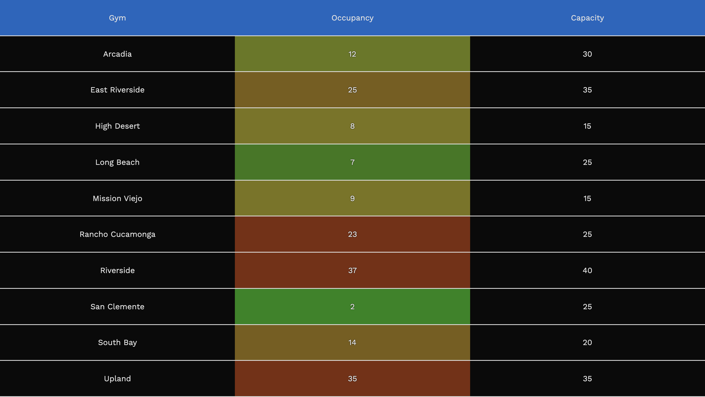

# CliffHangar

An Elm frontend for checking the current Hangar 18 occupancy info with a clean
UI.

Also a Python 3 web scraper for ingesting occupancy data into Google Sheets for
historical analysis.
